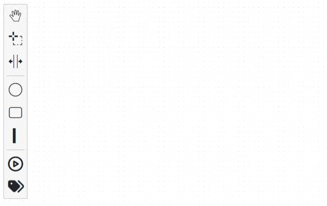

# Petri Net Editor

A web-based Petri net modeling and simulation tool built with diagram-js. This editor allows you to create, edit, simulate, and export Petri nets using an intuitive visual interface.



Checkout the [live demo](https://processintelligence.github.io/petrinet-io/) 🖥️.

## Installation

Use the library by installing it via npm into your application using:

```console
npm install petrinet-io
```

## Usage

To get started, just include the library and call the construction, providing the element that should contain the editor:

```js
import { PetriNetIO } from "petrinet-io";

const pn = new PetriNetIO({
	container: "#canvas",
});
```

### Methods

It is possible to interact with the `pn` object using the different methods. To load a `.pnml` file use:
```js
pn.loadFromFile()
```
To export the current model as `.pnml`:
```js
pn.exportPNML()
```
To export the current model as `.tpn`:
```js
pn.exportTpn()
```
To export the current model as `.svg`:
```js
pn.exportSVG()
```
To export the current model as `.pdf`:
```js
pn.exportPDF()
```


## Complete Vue example

```vue
<template>
  <main>
    <button @click="container.loadFromFile()">load pnml</button>
    <button @click="container.exportPNML()">export pnml</button>
    <button @click="container.exportTpn()">export tpn</button>
    <button @click="container.exportSVG()">export svg</button>
    <button @click="container.exportPDF()">export pdf</button>

    <div id="canvas" style="height: 800px; width: 100%;"></div>
  </main>
</template>

<script setup>
import { onMounted } from "vue";
import { PetriNetIO } from "petrinet-io";

let container = null;

onMounted(() => {
  container = new PetriNetIO({
    container: "#canvas",
  });
});
</script>
```